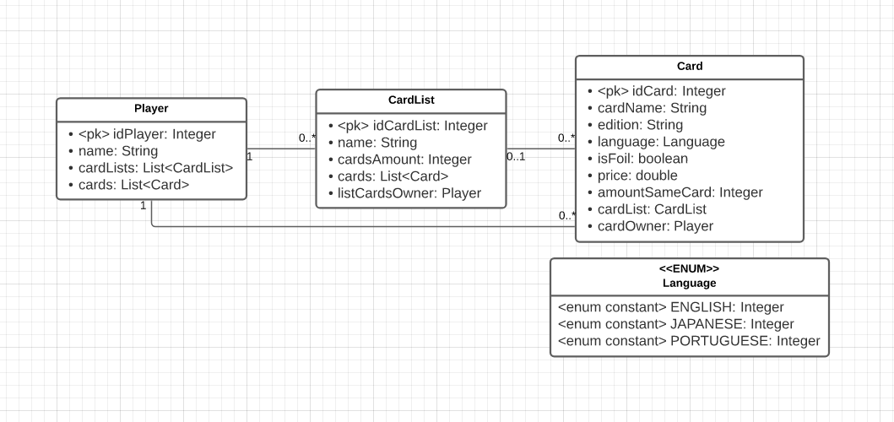

<h1>Desafio: Traga toda sua força!</h1>
Aplicação criada para suprir o desafio proposto pela empresa Zappts no processo seletivo para o banco de talentos da mesma. 
<h3><a href="https://desafio-zappts.herokuapp.com/swagger-ui/index.html#/"><u>APLICAÇÃO RODANDO NA NUVEM</u></a> </h3>

API Restful com Java 1.8, Spring Boot 2.6.4, Maven 3.1.1, Swagger 3.0.0, Jacoco 0.8.2 e PostgreSQL 14.


[](https://codecov.io/gh/mikaelsonbraz/Desafio-Traga-toda-sua-forca)

_____

<h2>GETTING STARTED</h2>

Certifique-se de ter o Maven instalado e adicionado ao PATH de seu sistema operacional, assim como o Git e o Postgres.

```
# Clone repository
git clone https://github.com/mikaelsonbraz/Desafio-Traga-toda-sua-forca.git

cd Desafio-Traga-toda-sua-forca

mvn spring-boot:run
```

_____

<h2>ENDPOINTS</h2>

<h3>PLAYERS</h2>

- POST - <a href="https://desafio-zappts.herokuapp.com/swagger-ui/index.html#/player-controller/createUsingPOST_2"><u>Adiciona um novo jogador</u></a>

- GET - <a href="https://desafio-zappts.herokuapp.com/swagger-ui/index.html#/player-controller/readUsingGET_2"><u>Pega um jogador por id</u></a>

- PUT - <a href="https://desafio-zappts.herokuapp.com/swagger-ui/index.html#/player-controller/updateUsingPUT_2"><u>Atualiza um jogador por id</u></a>

- DELETE - <a href="https://desafio-zappts.herokuapp.com/swagger-ui/index.html#/player-controller/deleteUsingDELETE_2"><u>Deleta um jogador por id</u></a>

<h3>CARD LISTS</h3>

- POST - <a href="https://desafio-zappts.herokuapp.com/swagger-ui/index.html#/card-list-controller/createUsingPOST_1"><u>Adiciona uma nova lista de cartas vazia</u></a>

- GET - <a href="https://desafio-zappts.herokuapp.com/swagger-ui/index.html#/card-list-controller/readUsingGET_1"><u>Pega uma lista de cartas por id</u></a>

- GET - <a href="https://desafio-zappts.herokuapp.com/swagger-ui/index.html#/card-list-controller/readAllCardsByNameUsingGET"><u>Pega uma lista de cartas com as cartas organizadas por ordem alfabética</u></a>

- GET - <a href="https://desafio-zappts.herokuapp.com/swagger-ui/index.html#/card-list-controller/readAllCardsByPriceUsingGET"><u>Pega uma lista de cartas com as cartas organizadas por preço crescente</u></a>

- PUT - <a href="https://desafio-zappts.herokuapp.com/swagger-ui/index.html#/card-list-controller/updateUsingPUT_1"><u>Atualiza uma lista de cartas por id</u></a>

- PATCH - <a href="https://desafio-zappts.herokuapp.com/swagger-ui/index.html#/card-list-controller/updateCardsUsingPATCH"><u>Adiciona uma carta numa lista de cartas atravées dos ids</u></a>

- PATCH - <a href="https://desafio-zappts.herokuapp.com/swagger-ui/index.html#/card-list-controller/removeCardUsingPATCH"><u>Remove uma carta numa lista de cartas através dos ids</u></a>

- DELETE - <a href="https://desafio-zappts.herokuapp.com/swagger-ui/index.html#/card-list-controller/deleteUsingDELETE_1"><u>Deleta uma lista de cartas por id</u></a>

<h3>CARDS</h3>

- POST - <a href="https://desafio-zappts.herokuapp.com/swagger-ui/index.html#/card-controller/createUsingPOST"><u>Adiciona uma nova carta</u></a>

- GET - <a href="https://desafio-zappts.herokuapp.com/swagger-ui/index.html#/card-controller/readUsingGET"><u>Pega uma carta por id</u></a>

- PUT - <a href="https://desafio-zappts.herokuapp.com/swagger-ui/index.html#/card-controller/updateUsingPUT"><u>Atualiza uma carta por id</u></a>

- DELETE - <a href="https://desafio-zappts.herokuapp.com/swagger-ui/index.html#/card-controller/deleteUsingDELETE"><u>Deleta uma carta por id</u></a>

_____

<h2>MODELO ENTIDADE-RELACIONAMENTO DO PROJETO


